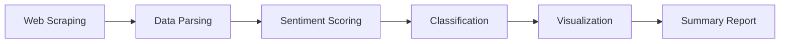

# 📰 News Headline Sentiment Analysis

<div align="center">


**An intelligent NLP-powered tool that scrapes, analyzes, and visualizes sentiment in real-time news headlines**

[Features](#-features) • [Installation](#-installation) • [Usage](#-usage) • [How It Works](#-how-it-works) • [Results](#-results)

</div>

---

## ✨ Features

🔍 **Real-Time Web Scraping** - Automatically fetches latest headlines from Hacker News  
🧠 **NLP Sentiment Analysis** - Leverages VADER (Valence Aware Dictionary and sEntiment Reasoner)  
📊 **Visual Analytics** - Generates beautiful sentiment distribution charts  
⚡ **Robust Error Handling** - Gracefully handles network issues and edge cases  
🎨 **Color-Coded Insights** - Intuitive visualization with green/gray/red sentiment indicators

---

## 🚀 Installation

### Prerequisites
- Python 3.7 or higher
- pip package manager

### Quick Setup

```bash
# Clone the repository
git clone https://github.com/yourusername/sentiment-analysis.git
cd sentiment-analysis

# Install required dependencies
pip install -r requirements.txt
```

### Manual Installation

```bash
pip install requests beautifulsoup4 pandas nltk matplotlib
```

---

## 📦 Dependencies

| Package | Version | Purpose |
|---------|---------|---------|
| `requests` | Latest | HTTP library for web scraping |
| `beautifulsoup4` | Latest | HTML parsing and extraction |
| `pandas` | Latest | Data manipulation and analysis |
| `nltk` | Latest | Natural Language Processing toolkit |
| `matplotlib` | Latest | Data visualization |

---

## 💻 Usage

The project is organized into **4 modular cells** for easy execution:

### Cell 1: Setup & Data Collection
```python
# Fetches headlines from Hacker News and creates DataFrame
python cell1_fetch_data.py
```

### Cell 2: Sentiment Analysis
```python
# Applies VADER sentiment scoring to headlines
python cell2_sentiment_analysis.py
```

### Cell 3: Visualization
```python
# Generates sentiment distribution bar chart
python cell3_visualization.py
```

### Cell 4: Summary Report
```python
# Displays comprehensive analysis results
python cell4_summary.py
```

---

## 🔬 How It Works



### 1️⃣ **Data Collection**
- Sends HTTP request to Hacker News
- Parses HTML using BeautifulSoup
- Extracts headlines using CSS selectors

### 2️⃣ **Sentiment Analysis**
- Uses NLTK's VADER SentimentIntensityAnalyzer
- Calculates compound scores (-1 to +1)
- Classifies into three categories:
  - **Positive** (≥ 0.05): Optimistic, favorable content
  - **Neutral** (-0.05 to 0.05): Balanced, factual reporting
  - **Negative** (≤ -0.05): Critical, concerning topics

### 3️⃣ **Visualization**
- Generates color-coded bar charts
- Uses matplotlib for professional graphics
- Exports high-resolution plots

---

## 📈 Results

### Sample Output

```
Successfully scraped 30 headlines.

Sentiment Distribution:
Neutral     18
Positive     8
Negative     4
```

### Visualization Example

The tool generates a bar chart showing:
- 🟢 **Green bars** for positive sentiment
- ⚫ **Gray bars** for neutral sentiment
- 🔴 **Red bars** for negative sentiment

---

## 🛠️ Configuration

### Changing Target URL

Modify the `URL` variable in Cell 1:

```python
URL = 'https://news.ycombinator.com/'  # Default: Hacker News
# Alternative options:
# URL = 'https://www.bbc.com/news'
# URL = 'https://www.reddit.com/r/news'
```

### Adjusting Sentiment Thresholds

Customize classification logic in Cell 2:

```python
def classify_sentiment(score):
    if score >= 0.05:      # More positive threshold
        return 'Positive'
    elif score <= -0.05:   # More negative threshold
        return 'Negative'
    else:
        return 'Neutral'
```

---

## 🎯 Use Cases

- 📊 **Market Research** - Track sentiment trends in tech news
- 📰 **Media Monitoring** - Analyze news tone over time
- 🔍 **Brand Analysis** - Monitor public perception
- 🎓 **Academic Research** - Study sentiment patterns in journalism
- 🤖 **AI Training** - Generate labeled datasets for ML models

---

## 🐛 Troubleshooting

### Common Issues

**Issue**: `ModuleNotFoundError: No module named 'nltk'`  
**Solution**: Run `pip install nltk`

**Issue**: Empty DataFrame after scraping  
**Solution**: Check internet connection or URL accessibility

**Issue**: VADER lexicon not found  
**Solution**: The script auto-downloads it, but you can manually run:
```python
import nltk
nltk.download('vader_lexicon')
```

---

## 🤝 Contributing

Contributions are welcome! Here's how you can help:

1. 🍴 Fork the repository
2. 🔨 Create a feature branch (`git checkout -b feature/AmazingFeature`)
3. 💾 Commit changes (`git commit -m 'Add AmazingFeature'`)
4. 📤 Push to branch (`git push origin feature/AmazingFeature`)
5. 🎉 Open a Pull Request

---

## 📝 License

This project is licensed under the MIT License - see the [LICENSE](LICENSE) file for details.

---

## 👏 Acknowledgments

- **NLTK Team** - For the powerful VADER sentiment analysis tool
- **Hacker News** - For providing accessible news content
- **BeautifulSoup** - For making web scraping elegant and simple

---

## 📧 Contact

**Shaista** 


---

<div align="center">

**Made with ❤️ and Python**

⭐ Star this repo if you found it helpful!

</div>

